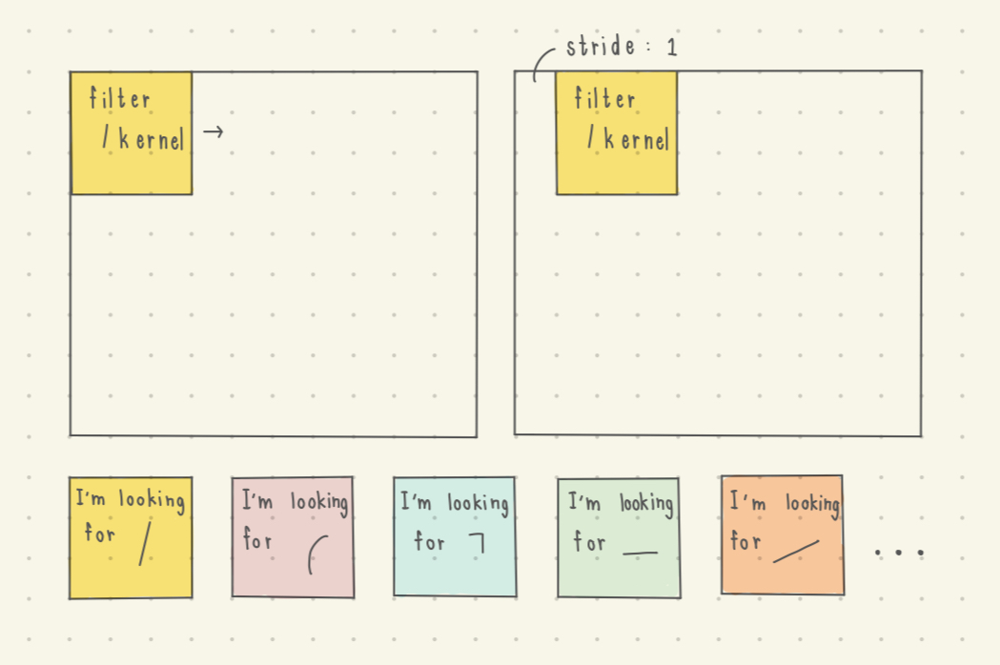

# Vanilla CNN Note 🍦🏞️
- The most fundamental practice for CNN is handwritten digit classification, therefore, we'll be using this dataset for our very very first exploration in detail!

## Dataset 📖
MNIST handwritten digit dataset (source: https://docs.pytorch.org/vision/main/generated/torchvision.datasets.MNIST.html)

| Data Set | 0 | 1 | 2 | 3 | 4 | 5 | 6 | 7 | 8 | 9 |
| -------- | -------- | -------- | -------- | -------- | -------- | -------- | -------- | -------- | -------- | -------- |
| Train Set  | 5923  | 6742 | 5958 | 6131 | 5842 | 5421 | 5918 | 6265 | 5851 | 5949 |
| Test Set  | 980 | 1135 | 1032 | 1010 | 982 |  892 | 958 | 1028 | 974 | 1009 |

The data consists of the 28 * 28 image (which get converted to tensor) and its label

## Architecture 🏗️
in our CNN model, we'll divide the architecture in 2 separate module instead, for simplicity:

1. **The Convolution Operation Module**
   - Convolution is simply a filter that detect each pattern that get slide through the input (so that the filter can find the pattern they're looking for !) 
   > **What is the pattern each filter looking for? How do we know?**  This is the value that deep learning will learn for us through training data and *backpropagation* 

   **Let come back to the process of convolution operation!**  
   👉1.1 Filter 
   *A tiny patch per our config, we can set its width and height and its stride*
   

 
   👉1.2 Activation Function 
   Activation Function still used here  
   👉1.3 Pooling Layer  
   Pooling Layer help to reduce the data size  
   - The popular pooling layer is "Max Pooling", the idea is just we get the largest value out!, so we can focus on what is important
   

2. **The Classification Module**
   - First, we flatten the tensor that output from the previous module, in order to do classification.
   - And then, we stack the layers with linear layer, activation function ReLU to introduce non-linearity, and then stack the last layer with another linear layer which output is 10 (# 0-9)
  
### CNN Training 🏃‍♀️
CNN Training happened in very similar way as MLP.  
*Step*
1. Forward Pass
2. Calculate Loss
3. BackPropogate & Adjusting each parameter!
